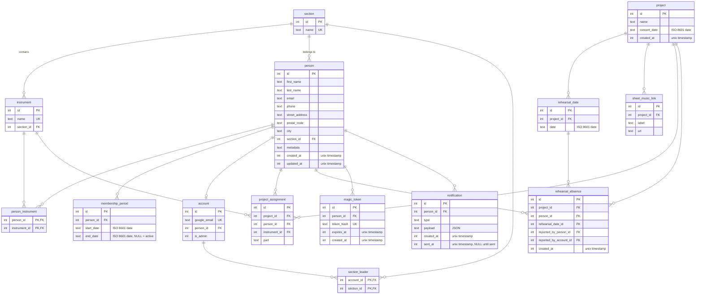

# Technical & Architectural Spec

Companion to [mvp-spec.md](mvp-spec.md). This document covers _how_ the system is built, not _what_ it does.

---

## 1. Tech Stack

| Layer | Choice | Notes |
|-------|--------|-------|
| Language | Python >= 3.13 | Type hints everywhere, enforced by Pyright |
| Web framework | Flask | Minimal, function-oriented. No class-based views. |
| Templating | Jinja2 | Ships with Flask |
| Database | SQLite (single file) | Sufficient for ~100 members, few concurrent writers |
| DB access | Raw SQL via `sqlite3` stdlib | No ORM. Queries stay explicit and auditable. |
| Migrations | `yoyo-migrations` | SQL-first migration tool. Raw SQL up/down files. |
| Frontend interactivity | HTMX 4 | Served from static files, no CDN dependency |
| CSS | Tailwind CSS via `pytailwindcss` | Standalone CLI wrapped as a Python package. No Node.js. |
| Auth (admin/leader) | Google OAuth 2.0 via `authlib` | |
| Auth (member) | Magic links with signed tokens | `itsdangerous` (ships with Flask) |
| Email | External (Google Apps Script) | See [Email](#email) section |
| Deployment | Single Linux VM | systemd + caddy reverse proxy |
| Process manager | gunicorn | WSGI |
| Type checking | Pyright (strict) | |
| Linting & formatting | Ruff | Replaces flake8, isort, black |
| Testing | pytest | |
| Package manager | uv | Fast, replaces pip/venv/pip-tools |

### Why no ORM

SQLite + raw SQL keeps the stack minimal. The data model is simple (< 10 tables), queries are straightforward CRUD, and raw SQL is easier to reason about and debug. `sqlite3` is in the stdlib — zero dependencies for DB access.

### Why no Node.js

`pytailwindcss` wraps the standalone Tailwind CLI binary as a pip-installable package — managed by uv alongside everything else. HTMX is a single JS file served statically. No Node.js or npm anywhere in the stack.

### Email

The system does not send email directly. An external Google Apps Script (or similar) polls the app's API for pending notifications (e.g., magic links to send) and dispatches email via Gmail. This keeps SMTP configuration out of the app and leverages the orchestra's existing Google Workspace.

---

## 2. Project Structure

Intentionally minimal. Let the structure emerge as the app grows.

```
orchestra/
├── app/                     # Flask application
│   ├── __init__.py          # create_app factory
│   ├── db.py                # Connection management
│   ├── auth.py              # Google SSO + magic link logic
│   ├── routes/              # Blueprints, one per domain
│   ├── templates/           # Jinja2 (full pages + HTMX partials)
│   └── static/              # htmx.min.js, compiled CSS
├── migrations/              # yoyo SQL migration files
├── docs/
├── tests/
└── pyproject.toml
```

### Routing convention

Each route module registers a Flask `Blueprint`. Routes return either:
- A full page (on regular GET requests)
- An HTML fragment (when `HX-Request` header is present)

This is handled by a small helper:

```python
def render(template, fragment_template=None, **context):
    if request.headers.get("HX-Request"):
        return render_template(fragment_template or f"partials/{template}", **context)
    return render_template(template, **context)
```

---

## 3. Architecture

### Request flow

```
Browser ──HTMX──▶ Caddy (TLS) ──▶ gunicorn ──▶ Flask app ──▶ SQLite
                                                    │
                                                    ▼
                                              Jinja2 → HTML fragment
                                                    │
                                                    ▼
                                              Browser (HTMX swaps DOM)

Apps Script ──poll──▶ /api/notifications/pending ──▶ Gmail
```

### HTMX patterns

The app is server-rendered. HTMX 4 handles partial page updates without full reloads.

Note: HTMX 4 defaults to explicit attribute inheritance (use `:inherited` suffix) and swaps 4xx/5xx responses into the target by default.

**Pattern 1: Inline editing**
```html
<!-- Display mode -->
<div hx-get="/members/42/edit" hx-swap="outerHTML">
  Anna Andersson — Tvärflöjt
</div>

<!-- Edit mode (returned as fragment) -->
<form hx-put="/members/42" hx-swap="outerHTML">
  <input name="first_name" value="Anna">
  ...
</form>
```

**Pattern 2: List filtering**
```html
<select name="section" hx-get="/members" hx-target="#member-list" hx-include="[name='search']">
  <option value="">Alla sektioner</option>
  ...
</select>
<div id="member-list">...</div>
```

**Pattern 3: Absence toggle**
```html
<button hx-post="/absences" hx-vals='{"project_id": 1, "rehearsal_date": "2026-04-10"}'
        hx-swap="outerHTML">
  Anmäl frånvaro
</button>
```

### HTML-first, with a small JSON API for integrations

Browser-facing routes return HTML. HTMX talks to the server in form-encoded data and receives HTML back.

A small JSON API (`/api/...`) will exist for external integrations — at minimum for the Apps Script email sender to poll for pending notifications. API spec TBD as the integration needs become clearer.

---

## 4. Data Model



Calendar dates (concert, rehearsal, membership) stored as ISO 8601 date strings (YYYY-MM-DD). Timestamps (created_at, updated_at, etc.) stored as Unix timestamp integers. Migration tracking is handled by `yoyo-migrations` (its own internal tables).

### SQLite pragmas (set on every connection)

```sql
PRAGMA journal_mode = WAL;          -- concurrent readers + single writer
PRAGMA foreign_keys = ON;           -- enforce FK constraints
PRAGMA busy_timeout = 5000;         -- wait 5s on write contention
PRAGMA synchronous = NORMAL;        -- safe with WAL
```

---

## 5. Auth Implementation

### Admin / Section leader: Google OAuth 2.0

1. User clicks "Logga in" → redirected to Google
2. Google callback returns email
3. Look up `account` by `google_email`
4. If found → set session cookie (Flask `session`, signed with `SECRET_KEY`)
5. If not found → reject with "not authorized" message
6. Session stores: `{"account_id": 42, "is_admin": true, "sections": [1, 3]}`

New admin/leader accounts are created by an existing admin (pre-authorized, not self-service).

### Member: Magic links

1. Admin triggers "send magic links" for a project (e.g. when assignments are finalized)
2. System generates a unique token per assigned member (via `secrets.token_urlsafe`)
3. Token hash (SHA-256) stored in `magic_token` table
4. Token + member info queued as a pending notification (for Apps Script to poll and send via Gmail)
5. Member clicks link → token verified against hash → session cookie set
6. Cookie stores: `{"person_id": 42, "expires": "2026-06-01"}`
7. Token expiry = latest concert date among the member's active project assignments

### Authorization helpers

```python
def require_admin(f):
    """Decorator: 403 unless current user is admin."""

def require_section_leader(*section_ids):
    """Decorator: 403 unless current user leads one of the given sections."""

def require_member_or_leader(person_id):
    """403 unless current user is the person or leads their section."""
```

---

## 6. Key Design Decisions

### D1: Raw SQL over ORM

**Decision:** Use `sqlite3` stdlib directly, no SQLAlchemy.
**Rationale:** < 10 tables, simple queries, one developer. An ORM adds abstraction without reducing complexity at this scale. Raw SQL is searchable, copy-pasteable into DB browser for debugging.

### D2: No SPA, no client-side state

**Decision:** Server-rendered HTML + HTMX for all interactivity.
**Rationale:** Eliminates an entire class of bugs (client/server state sync). Simpler mental model. Member-facing pages are simple enough that full page rendering is fine.

### D3: Magic links over member accounts

**Decision:** Members authenticate via emailed magic links, not passwords or SSO.
**Rationale:** Orchestra members span all ages and tech comfort levels. A link in an email is the lowest-friction access method. The security trade-off (link forwarding) is acceptable for non-sensitive internal data.

### D4: SQLite over PostgreSQL

**Decision:** SQLite in WAL mode.
**Rationale:** Single-server deployment, ~100 users, low write concurrency. SQLite removes the need for a separate database process, simplifies backups (copy one file), and simplifies development (no Docker/service needed). Can migrate to PostgreSQL later if needed — raw SQL makes this straightforward.

### D5: Functional style in Python

**Decision:** Functions over classes. No method-heavy service objects.
**Rationale:** Route handlers are pure-ish functions: request in → HTML out. DB queries are functions that take a connection and return data. Matches the developer's preference and keeps the code flat and readable.

### D6: yoyo-migrations

**Decision:** Use `yoyo-migrations` for schema changes.
**Rationale:** SQL-first (no Python migration classes), lightweight, supports raw SQL up/down files. Simpler than Alembic, but provides rollback support and tracking that hand-written scripts lack.

### D7: Swedish UI, English code

**Decision:** User-facing text in Swedish, code (variable names, comments, git) in English.
**Rationale:** Users are Swedish speakers. Code stays in English for consistency with libraries, tooling, and Claude Code assistance.

### D8: Strict type hints with Pyright

**Decision:** All code is fully type-annotated. Pyright in strict mode is the type checker.
**Rationale:** Catches bugs at edit time, serves as living documentation, and improves Claude Code's ability to generate correct code (it can follow type signatures). Python 3.13 provides modern syntax (`type` statements, `X | Y` unions) that keeps annotations clean.
